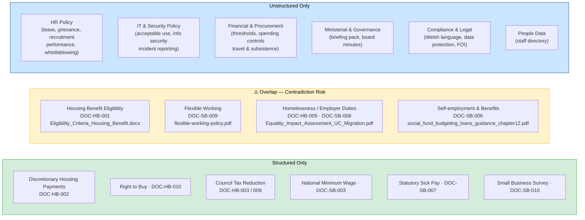

# Challenge 2 — Data Categories

**Event:** DSIT AI Engineering Lab, London 2026  
**Date:** 16 April 2026

This document maps the two source corpora to their information categories and highlights where they overlap.

---

## Structured Files

**Location:** `challenge-info/data/structured_files/`  
**Count:** 20 documents  
**Formats:** `.html` · `.md` · `.txt`

### Domain A — Housing & Benefits (`DOC-HB-*`)

| Document ID | Title / Topic | Format |
|---|---|---|
| DOC-HB-001 | Housing Benefit — eligibility criteria | HTML |
| DOC-HB-002 | Discretionary Housing Payments | MD |
| DOC-HB-003 | Council Tax Reduction regulations | TXT |
| DOC-HB-004 | Social housing FAQ | HTML |
| DOC-HB-005 | Homelessness prevention | TXT |
| DOC-HB-006 | Housing Benefit claim form instructions | MD |
| DOC-HB-007 | Housing Benefit statistics Q3 | HTML |
| DOC-HB-008 | DHP consultation responses | TXT |
| DOC-HB-009 | Council Tax Reduction (updated) | TXT |
| DOC-HB-010 | Right to Buy | MD |

### Domain B — Small Business & Employment (`DOC-SB-*`)

| Document ID | Title / Topic | Format |
|---|---|---|
| DOC-SB-001 | Starting a business | HTML |
| DOC-SB-002 | Registering as self-employed | MD |
| DOC-SB-003 | National Minimum Wage | HTML |
| DOC-SB-004 | Workplace pensions | TXT |
| DOC-SB-005 | Employment Rights Act 1996 | MD |
| DOC-SB-006 | Self-employment & Housing Benefit crossover | MD |
| DOC-SB-007 | Statutory Sick Pay | HTML |
| DOC-SB-008 | Employer duties — homelessness | HTML |
| DOC-SB-009 | Flexible working | MD |
| DOC-SB-010 | Small business survey 2025 | HTML |

---

## Unstructured Files

**Location:** `challenge-info/data/unstructured_files/`  
**Count:** 23 documents  
**Formats:** `.pdf` · `.docx` · `.xlsx`

| Category | File | Format |
|---|---|---|
| **HR Policy** | Annual_Leave_Policy | .docx |
| | flexible-working-policy | .pdf |
| | Grievance_Policy_2024 | .docx |
| | Recruitment_and_Selection_Policy | .pdf |
| | Performance_Management_Framework_2024-25 | .docx |
| | Raising Concerns (Whistleblowing) Guidance | .docx |
| | SOCIAL MEDIA GUIDANCE FOR STAFF | .docx |
| **IT & Security Policy** | Acceptable_Use_Policy_IT_Systems | .pdf |
| | Information Security Policy - DRAFT v0.8 | .docx |
| | incident-reporting-v1 | .docx |
| **Financial & Procurement** | Procurement Thresholds 2024-25 | .xlsx |
| | Spending_Controls_Guidance | .pdf |
| | Overpayment_Recovery_Procedures_v2.3 | .xlsx |
| | travel-and-subsistence-policy-v2.0 | .docx |
| **Ministerial & Governance** | Ministers_Questions_Briefing_Pack_12March | .pdf |
| | Programme Board Minutes 14 Feb 2024 | .docx |
| | Equality_Impact_Assessment_UC_Migration | .pdf |
| **Benefits Guidance** | Eligibility_Criteria_Housing_Benefit | .docx |
| | social_fund_budgeting_loans_guidance_chapter12 | .pdf |
| **Compliance & Legal** | Welsh_Language_Standards_Compliance_Report_2023 | .pdf |
| | Data Protection Guidance for Staff - March 2024 | .pdf |
| | FOI_Response_Template | .docx |
| **People Data** | Staff_Directory_Extract_Q4_2023 | .xlsx |

---

## Category Overlap Map

These topics appear in **both** corpora — they are the primary candidates for cross-corpus contradiction detection.

---

## Summary

| | Structured | Unstructured | Total |
|---|---|---|---|
| Document count | 20 | 23 | 43 |
| Formats | HTML · MD · TXT | PDF · DOCX · XLSX | — |
| Policy domains | 2 (HB, SB) | 6 categories | — |
| Overlap topics (contradiction risk) | 4 | 4 | 4 shared |
| Indexed in prototype today | ✅ 20 | ⬜ 0 | — |
